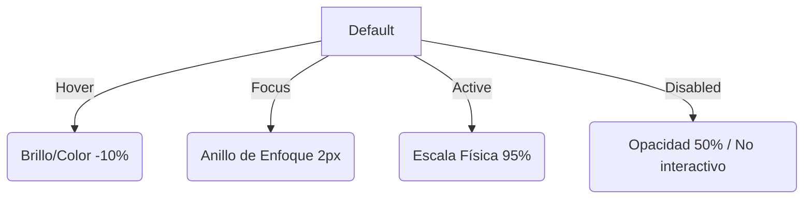

# Sistema de Diseño y Guía de Identidad Visual — EDU-US

Este documento define la especificación técnica, de diseño visual e interactiva para la plataforma **EDU-US** (Conectando jóvenes peruanos con oportunidades académicas internacionales). 

Ha sido diseñado específicamente para servir como **puente de comunicación directo** entre el equipo de **Diseño UI/UX (Figma)** y el equipo de **Desarrollo Frontend (React & Tailwind CSS)**. Su objetivo es asegurar que cada pixel, color y comportamiento definido en Figma se traduzca de forma exacta y sistemática en el código de producción.

---

## 1. Configuración de Figma y Rejilla (Workspace & Layout)

Para mantener la coherencia espacial y visual, el diseño en Figma debe alinearse con la rejilla (grid) y los contenedores de Tailwind CSS.

### A. Tamaños de Pantalla de Referencia (Artboards)
Al diseñar en Figma, utiliza las siguientes resoluciones base para los marcos (frames):
*   **Desktop (Escritorio)**: `1440 x 900 px` (Base para layouts de laptop/desktop).
*   **Tablet (Tableta)**: `768 x 1024 px` (Punto medio de adaptación).
*   **Mobile (Móvil)**: `375 x 812 px` (Diseño responsivo para smartphones).

### B. Rejillas de Distribución (Layout Grids)
La estructura horizontal del sitio se organiza mediante columnas fluidas:

| Dispositivo | Breakpoint Tailwind | Columnas | Margen Lateral (Margin) | Espaciado (Gutter) | Clase Contenedor Base |
| :--- | :--- | :---: | :--- | :--- | :--- |
| **Mobile** | Base (`< 640px`) | **4** | `16px` (`px-4`) | `16px` (`gap-4`) | `w-full px-4` |
| **Tablet** | `md:` (`>= 768px`) | **8** | `24px` (`px-6`) | `16px` (`gap-4`) | `w-full md:px-6` |
| **Desktop** | `lg:` (`>= 1024px`) | **12** | `32px` (`px-8`) | `24px` (`gap-6`) | `max-w-7xl mx-auto px-8` |

> [!IMPORTANT]
> El contenedor principal en desktop tiene un ancho máximo de **1280px** (`max-w-7xl`) y se centra automáticamente en pantalla (`mx-auto`). Toda la información crítica debe mantenerse dentro de esta caja.

### C. Ritmo Espacial (Sistema Base de 8px)
No utilices valores de espaciado o padding aleatorios en Figma. Todo el espaciado vertical y horizontal (márgenes, paddings, gaps) debe regirse por incrementos de **8px** (con soporte de **4px** para micro-espaciados):

| Multiplicador | Pixel (Figma) | Tailwind Utility | Uso Recomendado en Componentes |
| :---: | :--- | :--- | :--- |
| 0.5x | `4px` | `p-1` / `m-1` / `gap-1` | Separación de tags pequeños, micro-paddings. |
| 1x | `8px` | `p-2` / `m-2` / `gap-2` | Espaciado entre label e input, padding de botones chicos. |
| 1.5x | `12px` | `p-3` / `m-3` / `gap-3` | Padding interno de tarjetas sencillas, separación de items. |
| 2x | `16px` | `p-4` / `m-4` / `gap-4` | Padding estándar de tarjetas, inputs y botones. |
| 3x | `24px` | `p-6` / `m-6` / `gap-6` | Separación de bloques en formularios, padding de cards grandes. |
| 4x | `32px` | `p-8` / `m-8` / `gap-8` | Padding de secciones de contenidos secundarios. |
| 6x | `48px` | `py-12` | Separador de secciones pequeñas en tema claro. |
| 8x | `64px` | `py-16` / `my-16` | Margen de secciones en Landing Page (Mobile/Tablet). |
| 10x | `80px` | `py-20` / `my-20` | Separación de secciones principales en Landing Page (Desktop). |

---

## 2. Tipografía y Jerarquía Visual (Typography System)

EDU-US combina dos tipografías con personalidades distintas para lograr un contraste moderno y dinámico.

*   **Tipografía de Títulos (Headings)**: **Space Grotesk** (Sans-serif geométrica). 
    *   *Rol*: Aporta un tono tecnológico, estructurado y vanguardista. Se usa en títulos de páginas, secciones e interactivos principales.
*   **Tipografía de Cuerpo (Body)**: **Nunito** (Sans-serif redondeada).
    *   *Rol*: Aporta legibilidad, suavidad y cercanía. Se usa en textos informativos, párrafos, formularios y tablas.

### Escala Tipográfica para Figma y Código

Para garantizar la correspondencia, configura los siguientes **Estilos de Texto** en tu archivo de Figma:

| Estilo Figma | Tamaño (px / rem) | Peso (Font-Weight) | Interlineado (Line-Height) | Clase Tailwind Equivalente |
| :--- | :--- | :--- | :--- | :--- |
| **Display/Hero** | `60px / 3.75rem` | ExtraBold (800) | 1.15 (`115%`) | `text-4xl sm:text-5xl md:text-6xl font-extrabold tracking-tight` |
| **Heading/H1** | `36px / 2.25rem` | Bold (700) | 1.2 (`120%`) | `text-3xl sm:text-4xl font-bold` |
| **Heading/H2** | `30px / 1.875rem` | Bold (700) | 1.25 (`125%`) | `text-2xl sm:text-3xl font-bold` |
| **Heading/H3** | `20px / 1.25rem` | Bold (700) | 1.3 (`130%`) | `text-xl font-bold` |
| **Heading/H4** | `18px / 1.125rem` | SemiBold (600) | 1.35 (`135%`) | `text-lg font-semibold` |
| **Body/Large** | `16px / 1rem` | Regular (400) | 1.5 (`150%`) | `text-base` |
| **Body/Medium** | `14px / 0.875rem` | Regular (400) / Medium (500) | 1.5 (`150%`) | `text-sm` |
| **Body/Small** | `12px / 0.75rem` | Regular (400) / SemiBold (600) | 1.4 (`140%`) | `text-xs` |
| **Body/Micro** | `10px / 0.625rem` | Bold (700) | 1.2 (`120%`) | `text-[10px] uppercase tracking-wider` |

---

## 3. Paleta de Colores (Color Tokens)

Nuestra paleta de colores equilibra un tono enérgico primario con acentos sofisticados y grises semánticos específicos. Todos los nombres de colores en Figma deben sincronizarse con los tokens de Tailwind.

### A. Colores Core (Brand Colors)

| Token Figma | Valor HEX | Tailwind Utility | Rol de Diseño |
| :--- | :--- | :--- | :--- |
| **Primary** | `#ec451d` | `bg-primary` / `text-primary` | Botones de llamado a la acción (CTA), enlaces clave, bordes activos. |
| **Secondary** | `#4db9a9` | `bg-secondary` / `text-secondary` | Acentos visuales secundarios, tags informativos, bordes interactivos. |
| **Secondary-Light** | `#E0F2F0` | `bg-secondary-light` | Fondos de sección suaves, overlays y áreas de contraste. |
| **Accent** | `#f5ba3c` | `bg-accent` / `text-accent` | Destacados y advertencias, iconos especiales, estrellas de favoritos. |
| **Light** | `#FFFFFF` | `bg-light` | Fondo base claro del sitio, tarjetas base e inputs. |
| **Dark** | `#222222` | `bg-dark` / `text-dark` | Texto principal del tema claro, fondo base de elementos negros. |

### B. Paleta de Grises Neutros (`gray`)
Diseñada específicamente para controlar las sombras, bordes y elevaciones de la interfaz. En el **Modo Oscuro (Panel de Admin)**, esta escala sirve para estructurar los planos visuales:

*   `gray-50`: `#f9fafb` — Fondo alternativo ultra claro (Modo Claro).
*   `gray-100`: `#f3f4f6` — Bordes suaves y divisores (Modo Claro).
*   `gray-200`: `#e5e7eb` — Bordes secundarios, placeholders inactivos.
*   `gray-300`: `#d1d5db` — Bordes predeterminados de formularios (Modo Claro).
*   `gray-400`: `#9ca3af` — Texto secundario y placeholders.
*   `gray-500`: `#6b7280` — Iconos neutros e indicaciones secundarias.
*   `gray-600`: `#4b5563` — Texto de soporte y labels (Modo Claro).
*   `gray-700`: `#374151` — Separadores y bordes en Modo Oscuro.
*   `gray-800`: `#1f2937` — Fondo de tarjetas e inputs en Modo Oscuro.
*   `gray-900`: `#111827` — Fondo base de página en Modo Oscuro.
*   `gray-950`: `#030712` — Fondo ultra profundo para barras laterales y cabeceras en Modo Oscuro.

### C. Estados de Soporte Semántico (Feedback Colors)
Úsalos en Figma para estados de validación, insignias de estado y notificaciones del sistema:

*   🔴 **Error / Peligro**: `#ef4444` (`bg-red-500` / `border-red-500` / `text-red-600`) — Acciones destructivas, campos con errores.
*   🟢 **Éxito (Success)**: `#10b981` (`bg-green-500` / `text-green-700`) — Acciones completadas, estado "Asistió".
*   🔵 **Información (Info)**: `#3b82f6` (`bg-blue-500` / `text-blue-700`) — Notificaciones del sistema, estado "Inscrito" (usando escala `blue-50` a `blue-700`).
*   🟡 **Advertencia (Warning)**: `#f59e0b` (`bg-amber-500` / `text-amber-800`) — Estados pendientes, advertencias de formularios.

### D. Degradados Oficiales Autorizados
Evita crear degradados personalizados que no estén definidos a continuación:

1.  **Brand Gradient (Títulos Destacados y Hero)**:
    *   *Fórmula*: `bg-gradient-to-r from-primary via-accent to-primary` (Degradado lineal horizontal de `#ec451d` a `#f5ba3c` a `#ec451d`).
2.  **Hero Dark Gradient (Fondo del Hero de Oportunidades)**:
    *   *Fórmula*: lineal de `#0b2826` (verde oscuro profundo) pasando por `#1a4d47` hacia `#0b2826`.
3.  **Soft Card Overlay (Reverso de Tarjetas Interactivas)**:
    *   *Fórmula*: `linear-gradient(135deg, #fef2f2 0%, #f0fdfa 50%, #fef9e6 100%)` (Degradado muy sutil de rojo claro, turquesa claro y amarillo claro).

---

## 4. Arquitectura del Modo Oscuro (Dark Mode System)

> [!NOTE]
> El Modo Oscuro en EDU-US está implementado de forma exclusiva en el **Panel de Administración (Dashboard)**. La Landing Page y las vistas públicas operan únicamente en Modo Claro.

En Figma, las pantallas administrativas deben contar con su respectiva variante en Modo Oscuro. La transición se realiza de forma automática en código mediante la directiva de clases de Tailwind (`dark:`):

### Tabla de Conversión Semántica (Claro ➡️ Oscuro)

| Elemento UI | Estado Claro | Estado Oscuro (Figma & Código) |
| :--- | :--- | :--- |
| **Lienzo Principal (Fondo Base)** | `#FFFFFF` (`bg-white`) | `#111827` (`dark:bg-gray-900`) |
| **Fondo de Tarjetas / Tablas** | `#FFFFFF` / `#f9fafb` | `#1f2937` (`dark:bg-gray-800`) |
| **Sidebar Administrativo (Fondo)**| `#f8fafc` (`bg-slate-50`) | `#030712` (`dark:bg-gray-950`) |
| **Texto de Título Principal** | `#222222` (`text-dark`) | `#f9fafb` (`dark:text-gray-50`) |
| **Texto de Cuerpo** | `#4b5563` (`text-gray-600`) | `#9ca3af` (`dark:text-gray-400`) |
| **Bordes e Hilos Divisorios** | `#f3f4f6` (`border-gray-100`) | `#374151` (`dark:border-gray-700`) |
| **Campos de Entrada (Fondo)** | `#FFFFFF` (`bg-white`) | `#1f2937` (`dark:bg-gray-800`) |
| **Campos de Entrada (Bordes)** | `#d1d5db` (`border-gray-300`) | `#4b5563` (`dark:border-gray-600`) |

---

## 5. Formas, Bordes y Elevaciones (Shapes & Shadows)

El diseño de EDU-US tiene un enfoque moderno "Glassmorphic" y limpio, con esquinas muy suaves y elevaciones sutiles.

### A. Radios de Borde (Border Radius)
*   `rounded-md` (**6px**): Aplicado a campos de entrada de texto (`inputs`), áreas de selección (`select`) y botones secundarios pequeños.
*   `rounded-xl` (**12px**): Aplicado a botones interactivos principales y contenedores de formularios internos.
*   `rounded-2xl` (**16px**): Estándar para tarjetas de contenido (Tarjetas de Oportunidades, Testimonios, Secciones de Impacto).
*   `rounded-[3rem]` (**48px**): Curvaturas extremas exclusivas para el final de secciones Hero y contenedores envolventes decorativos.
*   `rounded-full` (**9999px / Circular**): Insignias de estado (píldoras), tags, avatares de usuario e indicadores numéricos.

### B. Sombras y Profundidad (Shadows & Backdrops)
*   **Shadow Card (Default)**: `shadow-md` (Sombra sutil, dispersión suave para separar tarjetas del fondo).
*   **Active Glow (Botón CTA)**: `shadow-sm shadow-primary/25 hover:shadow-xl hover:shadow-primary/30` (Sombra exterior con color primario translúcido al 25% que aumenta al hacer hover, simulando un brillo o aura).
*   **Efecto Vidrio Esmerilado (Glassmorphism en Navbar)**:
    *   *Filtro en Figma*: Background Blur = `16px` o `20px`.
    *   *Fórmula CSS*:
        ```css
        background: rgba(255, 255, 255, 0.85);
        backdrop-filter: blur(20px);
        border-bottom: 1px solid rgba(226, 232, 240, 0.8);
        ```

---

## 6. Especificación de Componentes Clave (Figma Components)

Al crear componentes en Figma, asegúrate de modelar cada uno de los estados interactivos definidos en el código.

### A. Botones (Buttons)
Basados en el componente global [Button.jsx](file:///home/anthony/dev/Projects/edu-us/src/components/ui/Button.jsx). 

*   **Paddings estándar**: 
    *   Mediano (predeterminado): `py-2.5 px-5` (Vertical: 10px, Horizontal: 20px).
    *   Grande: `py-3 px-6` (Vertical: 12px, Horizontal: 24px).
*   **Variante Primaria (CTA)**: Fondo `#ec451d` (`bg-primary`), texto blanco.
    *   *Hover*: Oscurece sutilmente a `bg-primary/90`.
    *   *Focus*: Anillo de enfoque con offset de 2px (`focus:ring-2 focus:ring-offset-2 focus:ring-primary`).
    *   *Active (Click)*: Escala física reducida a `95%` (`active:scale-95`).
    *   *Disabled*: Opacidad al 50% (`disabled:opacity-50`).
*   **Variante Secundaria**: Borde gris `#d1d5db`, fondo blanco `#FFFFFF`, texto `#374151` (`text-gray-700`).
    *   *Hover*: Fondo gris ultra claro `bg-gray-50` (`#f9fafb`).



### B. Inputs de Formularios
Basados en el componente global [Input.jsx](file:///home/anthony/dev/Projects/edu-us/src/components/ui/Input.jsx).

*   **Paddings**: Horizontal `16px`, Vertical `10px`.
*   **Estados Visuales**:
    *   *Predeterminado*: Fondo `#FFFFFF`, borde gris `#d1d5db` (`border-gray-300`), texto placeholder en `#9ca3af`.
    *   *Enfoque (Focus)*: Borde se oculta o cambia de color y se aplica un anillo exterior grueso primario (`focus:ring-2 focus:ring-primary`).
    *   *Error*: Borde de color rojo `#ef4444`, icono de alerta a la derecha, y texto descriptivo inferior en `#dc2626`.

### C. Insignias de Estado (Badges)
Píldoras circulares con textos cortos en mayúsculas (`text-xs font-semibold uppercase tracking-wider`).

*   **Inscrito / Registrado**: Fondo `#eff6ff` (Azul claro), texto `#1d4ed8` (Azul oscuro).
*   **Asistió / Completado**: Fondo `#d1fae5` (Verde claro), texto `#065f46` (Verde oscuro).
*   **Cancelado / Inactivo**: Fondo `#fee2e2` (Rojo claro), texto `#991b1b` (Rojo oscuro).

### D. Tarjeta de Oportunidades (Opportunity Card)
Componente estructurado en [OpportunityCard.jsx](file:///home/anthony/dev/Projects/edu-us/src/components/opportunities/OpportunityCard.jsx).

*   **Estructura de Figma**:
    *   Contenedor: `w-full`, `rounded-2xl` (16px), fondo blanco, borde de 1px en `#f3f4f6`.
    *   Imagen: Parte superior, proporción `16:9` (`aspect-video`), recortada en los bordes superiores de la tarjeta.
    *   Cuerpo: Padding interno `p-6` (24px).
    *   Interacción: Al hacer hover, la tarjeta debe elevarse verticalmente (`-translate-y-1`) y su sombra debe intensificarse a `shadow-lg`.

### E. Tarjeta Giratoria (Flip Card / About Card)
Utilizada en la sección "Lo que hacemos hoy" ([AboutSection.jsx](file:///home/anthony/dev/Projects/edu-us/src/components/home/AboutSection.jsx)).

*   **Comportamiento**: La tarjeta rota 180 grados sobre el eje Y al pasar el cursor (Hover).
*   **Especificación de Figma**:
    *   Diseña dos caras con dimensiones exactas (`w-full` y altura fija de `384px` o `320px` según dispositivo).
    *   **Cara Frontal**: Imagen a sangre completa (`object-cover`), gradiente negro sutil superior con el título en texto blanco, e icono indicador en esquina superior derecha.
    *   **Cara Trasera**: Fondo degradado sutil (`#fef2f2` a `#f0fdfa` a `#fef9e6`), texto centrado, e icono decorativo superior.

---

## 7. Iconografía y Directivas de Media (Icons & Assets)

Para asegurar la ligereza de carga y la nitidez visual en todas las resoluciones, los recursos deben crearse y exportarse bajo las siguientes reglas.

### A. Iconos (Figma a React)
*   **Librería**: **Lucide Icons** (sincronizada en React a través de `lucide-react`).
*   **Especificaciones Técnicas**:
    *   Estilo: Vectorial de trazo lineal (outline). Grosor de trazo estándar = **2px**.
    *   Cajas de delimitación (bounding box) sugeridas en Figma: `16 x 16 px` (micro), `20 x 20 px` (estándar para botones y listas) o `24 x 24 px` (cabeceras).
    *   Esquinas de los trazos: Redondeadas (Round joints y round caps).

### B. Imágenes y Recursos Gráficos
*   **Fotografías de Oportunidades**: Relación de aspecto obligatoria de **16:9** (para evitar deformaciones al subirse en la base de datos).
*   **Ilustraciones**: De estilo plano o con degradados muy suaves que utilicen la paleta de la marca (Primary, Secondary, Accent).
*   **Formato de Exportación (Figma)**:
    *   **Logos y Vectores**: Siempre exportar en formato **SVG** limpio.
    *   **Imágenes fotográficas**: Exportar en **WebP** o **JPEG** comprimido a 85% de calidad para optimizar el rendimiento del sitio.

---

## 8. Movimientos y Transiciones (Motion System)

El movimiento en EDU-US está pensado para dar una sensación orgánica de respuesta inmediata al usuario. 

En Figma, usa las siguientes curvas y tiempos al crear prototipos animados:

*   **Transición Rápida (Hover / Focus en Botones y Enlaces)**:
    *   *Propiedad*: `transition-colors` o `transition-all`.
    *   *Duración*: **200ms** (`duration-200`).
    *   *Curva*: `ease-in-out` (desaceleración y aceleración estándar).
*   **Animación de Apertura (Modales y Desplegables)**:
    *   *Propiedad*: Opacidad y desplazamiento vertical leve (`translate-y-2` a `translate-y-0`).
    *   *Duración*: **300ms** (`duration-300`).
    *   *Curva*: `ease-out` (desaceleración rápida para dar sensación de inmediatez).
*   **Indicador de Navegación Activo (Header / Navbar)**:
    *   *Comportamiento*: Desplazamiento elástico ("Spring") al cambiar de pestaña activa.
    *   *Framer Motion*: `stiffness: 380, damping: 30` (Efecto de muelle rápido con rebote mínimo controlado).
*   **Giro Y (Flip Card de Proyectos)**:
    *   *Propiedad*: Rotación 3D en eje Y (`rotateY(180deg)`).
    *   *Duración*: **700ms** (`duration-700`).
    *   *Curva*: Desaceleración suave para un movimiento fotográfico premium.

---

## 9. Pautas de Accesibilidad (A11y / WCAG 2.2)

EDU-US tiene un fuerte compromiso social, por lo cual es obligatorio garantizar la accesibilidad de la interfaz.

*   **Tamaño de Áreas Clickeables (Touch Targets)**:
    *   Cualquier elemento interactivo (botones, tags de cierre, enlaces, iconos de redes sociales) debe tener un área táctil mínima de **44 x 44 px** en Figma, añadiendo padding invisible si el elemento visual es más pequeño.
*   **Contraste de Texto (WCAG AA)**:
    *   Todo texto en Nunito o Space Grotesk debe mantener un contraste de color mínimo de **4.5:1** contra el fondo circundante.
    *   *Ejemplo aprobado*: Texto `#222222` sobre fondo `#FFFFFF`.
    *   *Ejemplo rechazado*: Texto `#4db9a9` (Turquesa) sobre fondo `#FFFFFF` (Falla el contraste para lectura de párrafos).
*   **Foco Visible de Teclado**:
    *   No elimines el contorno de enfoque (`focus:outline-none`) en Figma sin diseñar un reemplazo visible y nítido para los usuarios que navegan mediante tabulación de teclado.

---

## 10. Reglas de Oro para el Diseño (Do's & Don'ts)

### ✅ Permitido (Do's)
*   **Hacer**: Usar `Space Grotesk` con un peso Bold (700) o ExtraBold (800) para darle personalidad a los títulos.
*   **Hacer**: Respetar el sistema de espaciado basado en 8px para asegurar alineación vertical.
*   **Hacer**: Usar variantes translúcidas de los colores principales para los fondos de tarjetas (ej. `bg-primary/8` o `bg-secondary/10`) en lugar de colores planos fuertes.
*   **Hacer**: Diseñar todas las pantallas de administración contemplando sus equivalencias exactas en Modo Oscuro.

### ❌ Prohibido (Don'ts)
*   **No hacer**: Utilizar más de un título `<h1>` por página (afecta la indexación SEO de la plataforma).
*   **No hacer**: Introducir colores planos predeterminados de la paleta básica de Tailwind (ej. un rojo chillón `bg-red-500` o azul `bg-blue-600`) para elementos destacados del diseño principal. Usa siempre los HEX oficiales.
*   **No hacer**: Usar la tipografía `Space Grotesk` para bloques largos de párrafos o contenido del cuerpo (dificulta la lectura fluida en pantallas pequeñas).
*   **No hacer**: Diseñar vistas del Panel de Administración con anchos de columna que no quepan en resoluciones estándar de laptop (ej. diseñar asumiendo pantallas de 1920px únicamente).
